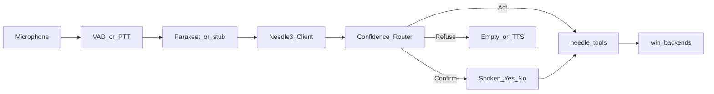
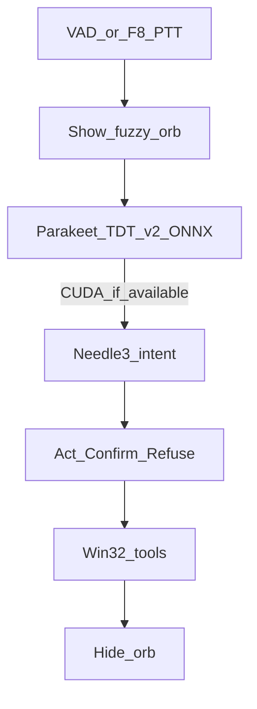

# cacti

Voice-first **Windows 11** desktop assistant: local STT (stub), **Needle 3** tool routing (`@needle.tool`), confidence tiers (Act / Confirm / Refuse), and native Win32 / UIA / Credential Manager backends.

## Architecture



## Confidence routing

| Tier | Rule |
|------|------|
| **Act** | Confidence ≥ 0.85 and tool risk `low` (and volume not 0/100) |
| **Confirm** | 0.50–0.84, or medium/high risk, or always-confirm tools (vault, OCR, default audio) |
| **Refuse** | &lt; 0.50 or unknown tool |

Implementation: [`src/cacti/routing/`](src/cacti/routing/).

## Tool catalog (12 core + registry helpers)

### System & hardware

| Tool | Example voice |
|------|----------------|
| `set_master_volume_percent` | “Set volume to fifty percent.” |
| `set_system_mute` | “Mute.” / “Unmute.” |
| `set_default_audio_output` | “Switch audio to headphones.” (**Confirm**) |

### Window & workspace

| Tool | Example voice |
|------|----------------|
| `focus_window` | “Switch to Chrome.” |
| `launch_application` | “Open Notepad.” (auto app registry) |
| `snap_window` | “Snap this window left.” / “Maximize.” |

### Context & screen

| Tool | Example voice |
|------|----------------|
| `get_foreground_window_title` | “What window am I in?” |
| `get_active_browser_url` | “What’s this tab’s URL?” |
| `ocr_foreground_window` | “Read what’s on screen.” (**Confirm**) |

### Security & vault

| Tool | Example voice |
|------|----------------|
| `credential_exists_for_target` | “Do I have a saved password for GitHub?” (**Confirm**) |
| `prompt_credential_for_target` | “Use my saved login for the VPN.” (**Confirm**) |
| `open_credential_manager_settings` | “Open credential manager.” |

### App registry (automatic)

| Tool | Role |
|------|------|
| `refresh_app_registry` | Rescan Start Menu, App Paths, uninstall registry, UWP apps |
| `list_matching_applications` | Disambiguate spoken app names |

No manual YAML: see [`src/cacti/apps/`](src/cacti/apps/).

## How the code works



1. **Cacti client** (`cacti-ui`) is the control panel: master on/off, wake, speech, and per-tool switches. Settings persist in `%LOCALAPPDATA%\cacti\settings.json`.
2. The **orb stays hidden** until speak-to-wake or hold-to-talk. Tray (if installed) → Open Cacti. No tray → the client window stays as home.
3. **Mic gate** captures one utterance (VAD silence or hotkey-up).
4. **Parakeet TDT 0.6B v2** transcribes locally. GPU if CUDA/DirectML is available.
5. Needle + router run the tool, then the orb hides unless a confirm is needed.

## Cacti client + ASR

```bash
pip install -e ".[dev]"
pip install -e ".[windows]"
pip install -e ".[asr-cuda]"   # NVIDIA GPU
# pip install -e ".[asr]"      # CPU-only speech

cacti-ui
```

First launch opens the client. Save settings, then hold **F8** or speak. First Parakeet run downloads ~2GB.

```bash
CACTI_FAKE_TOOL="set_system_mute:muted=true:confidence=0.95" cacti --text "mute"
cacti --text "open notepad"
```

Register all tools for Needle compilation:

```python
from cacti.needle_registry import ALL_TOOLS
```

Swap `cacti.needle_shim.tool` for `needle.tool` when the Cactus Needle 3 SDK is installed.

## Layout

```
src/cacti/
  needle_registry.py      # all @needle.tool exports
  routing/                # tiers + router
  assistant/              # engine, Parakeet STT, VAD/PTT wake
  ui/                     # client (toggles) + hidden orb + tray
  tools/                  # system, windows, context, security, registry
  apps/                   # automatic app discovery + cache
  win/                    # volume, windows_uia, browser_uia, ocr, credentials, …
```

## Testing

```bash
PYTHONPATH=src python3 -m pytest
```

Linux CI runs router/registry tests; full Win32 integration requires Windows 11 + `[windows]` extras.

## Security notes

- Vault tools never return passwords on the Act path; `prompt_credential_for_target` returns a `session:…` handle for downstream UI fill.
- OCR and credential checks require **Confirm** regardless of model score.
